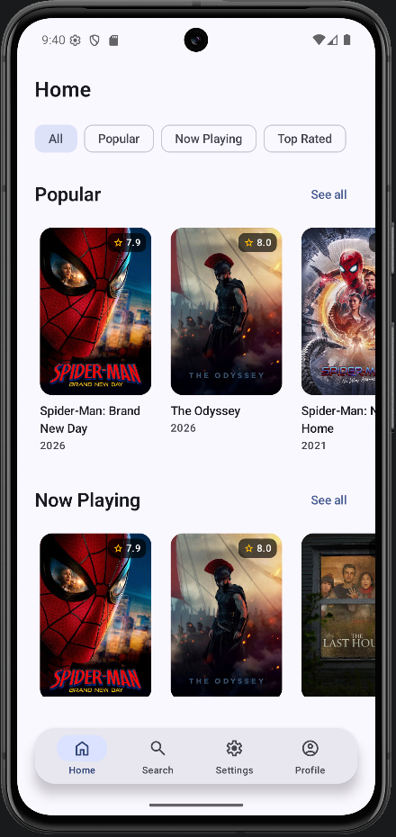
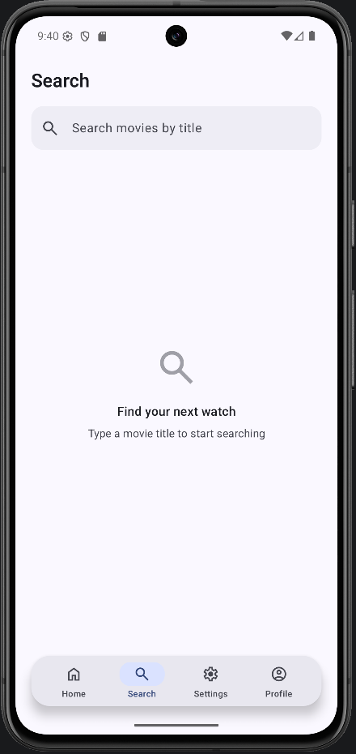
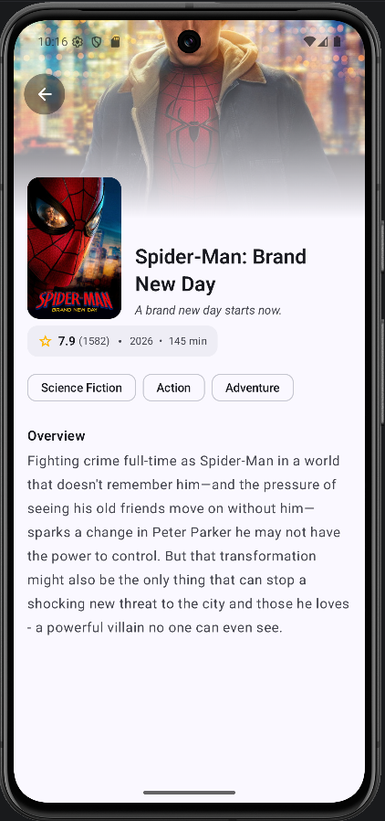
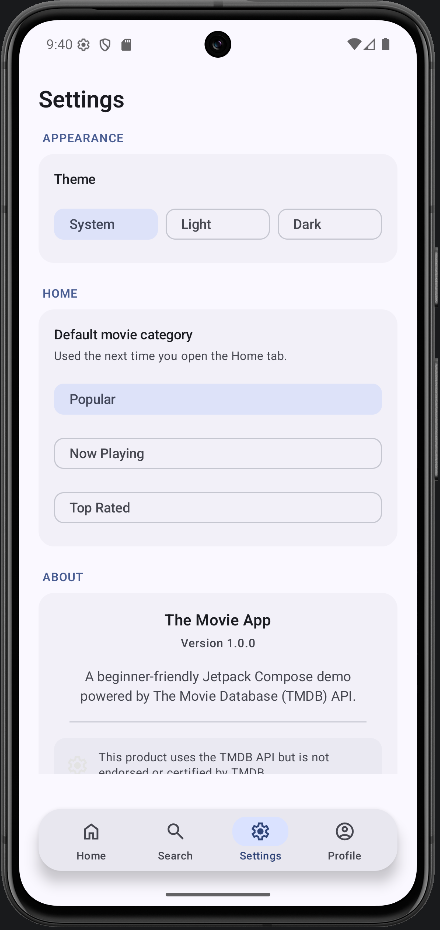
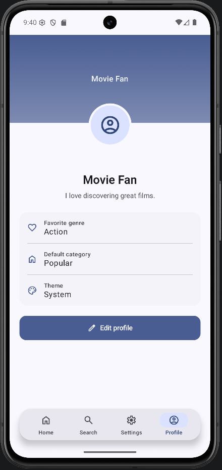

# 🎬 The Movie App

[](https://kotlinlang.org)
[](https://developer.android.com/jetpack/compose)
[](https://m3.material.io)
[](LICENSE)

**The Movie App** is a modern Android application built with Jetpack Compose that leverages the TMDB API to showcase popular, now playing, and top-rated movies. It features a clean Material 3 design, seamless navigation, and user preference management using DataStore.

---

## 📸 Screenshots

| Home | Search | Movie Details | Settings | Profile |
|------|--------|---------------|----------|---------|
|  |  |  |  |  |

---

## ✨ Features

*   **Browse Movies**: Explore sections for Popular, Now Playing, and Top Rated films.
*   **Search Functionality**: Search for any movie in the TMDB database with real-time results.
*   **Detailed View**: View comprehensive movie information, including backdrops, posters, ratings, and plot overviews.
*   **User Profile**: Customize your profile with a display name, bio, and favorite genre.
*   **Settings**: Manage app preferences like Theme Mode (System, Light, Dark) and default movie categories.
*   **Material 3 UI**: Modern, sleek interface adhering to the latest Android design standards.
*   **Persistent Preferences**: User settings are saved locally using Jetpack DataStore.
*   **Image Loading**: High-quality image rendering with Coil.
*   **Adaptive Launcher Icon**: Optimized icons for various device home screens.

---

## 🛠 Tech Stack

*   **Kotlin**: Primary programming language.
*   **Jetpack Compose**: Modern toolkit for building native UI.
*   **Material 3**: Latest version of Google's open-source design system.
*   **Navigation Compose**: Declarative navigation for Compose.
*   **Retrofit & OkHttp**: Networking and API interaction.
*   **Kotlinx Serialization**: Type-safe JSON parsing.
*   **Coil**: Image loading library for Android.
*   **DataStore Preferences**: Reactive data storage for simple key-value pairs.
*   **ViewModel**: Architecture component to store and manage UI-related data.
*   **Coroutines & Flow**: Asynchronous programming and reactive data streams.

---

## 🏛 Architecture

The project follows the recommended **MVVM (Model-View-ViewModel)** architecture and the **Repository Pattern** to ensure a clean separation of concerns and maintainability.

*   **Single Activity Architecture**: The entire app runs within a single `MainActivity`.
*   **Navigation Compose**: Handles transitions between different screens via `NavGraph`.
*   **Dependency Injection**: Manual DI implemented via a `DefaultAppContainer` for service and repository provisioning.

---

## 📂 Project Structure

```text
app/
 ├── data/                # Repositories and local data management (DataStore)
 ├── model/               # Data models and DTOs
 ├── network/             # Retrofit service and API client configuration
 ├── ui/
 │   ├── components/      # Reusable UI widgets
 │   ├── detail/          # Movie detail screen and logic
 │   ├── home/            # Home screen and logic
 │   ├── profile/         # User profile screen and logic
 │   ├── search/          # Search screen and logic
 │   ├── settings/        # App settings screen and logic
 │   ├── theme/           # Color, Type, and Theme definitions
 │   └── NavGraph.kt      # Navigation routing
 ├── MainActivity.kt      # Entry point of the application
 └── MovieApplication.kt   # Application class for global initialization
```

---

## 🚀 Installation

1.  **Clone the repository**:
    ```bash
    git clone https://github.com/SamratVsn/TheMovieApp.git
    ```
2.  **Open in Android Studio**: Open the root folder of the project.
3.  **Set up API Key**: Add your TMDB API Key to `local.properties`:
    ```properties
    TMDB_API_KEY=your_api_key_here
    ```
4.  **Sync Gradle**: Wait for Android Studio to download dependencies and sync the project.
5.  **Run the app**: Click the "Run" button or press `Shift + F10`.

---

## 📋 Requirements

*   **Minimum SDK**: 24
*   **Target SDK**: 37
*   **Compile SDK**: 37
*   **Kotlin Version**: 2.2.10
*   **Gradle Version**: 9.3.1 (AGP)

---

## 📦 Libraries Used

| Library | Purpose |
| ------- | ------- |
| `androidx.compose` | UI Toolkit |
| `androidx.navigation` | App Navigation |
| `com.squareup.retrofit2` | API Requests |
| `io.coil-kt:coil-compose` | Image Loading |
| `androidx.datastore` | Local Persistence |
| `kotlinx.serialization` | Data Parsing |
| `okhttp3:logging-interceptor` | Network Debugging |

---

## 🔮 Future Improvements

*   **Favorites/Watchlist**: Allow users to save movies for later viewing.
*   **Trailer Integration**: Embed YouTube players to watch movie trailers.
*   **Pagination**: Implement Paging 3 for infinite scrolling in search and lists.
*   **Offline Support**: Cache API responses with Room for offline browsing.
*   **Push Notifications**: Notify users about new releases or updates to their watchlist.

---

## 📄 License

```text
MIT License

Copyright (c) 2026 Samrat Parajuli

Permission is hereby granted, free of charge, to any person obtaining a copy
of this software and associated documentation files (the "Software"), to deal
in the Software without restriction, including without limitation the rights
to use, copy, modify, merge, publish, distribute, sublicense, and/or sell
copies of the Software, and to permit persons to whom the Software is
furnished to do so, subject to the following conditions...
```

---

## 👤 Author

**Samrat Parajuli**

*   **Portfolio**: [samratparajuli0.com.np](https://www.samratparajuli0.com.np/)
*   **GitHub**: [@SamratVsn](https://github.com/SamratVsn)
*   **LinkedIn**: [samratvsn](https://linkedin.com/in/samratvsn)
