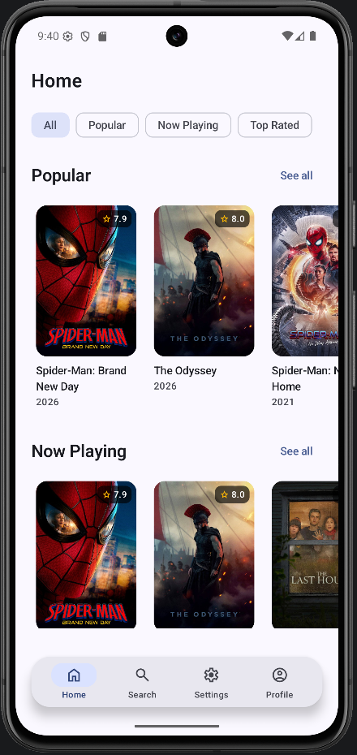
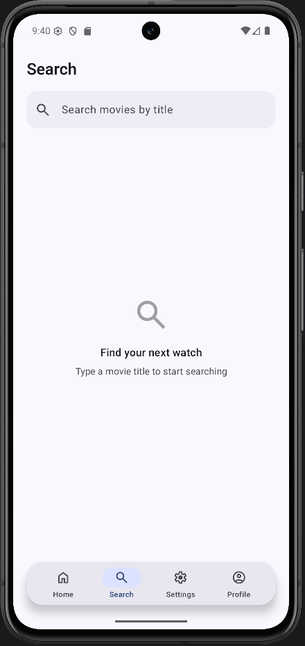
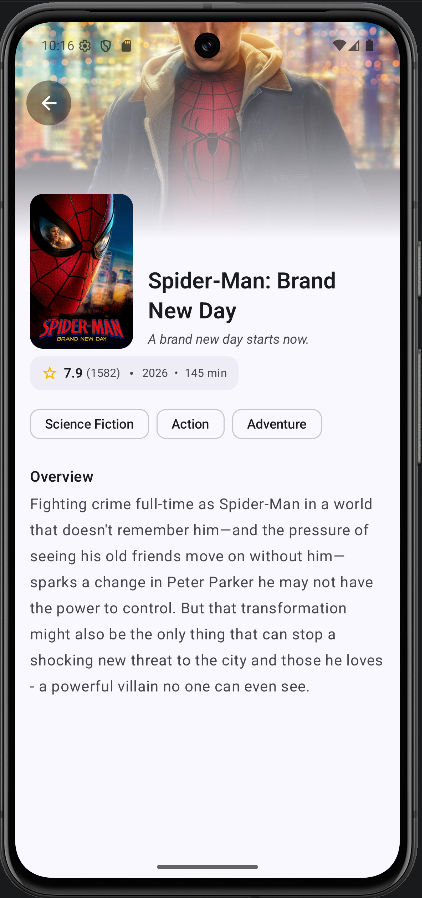
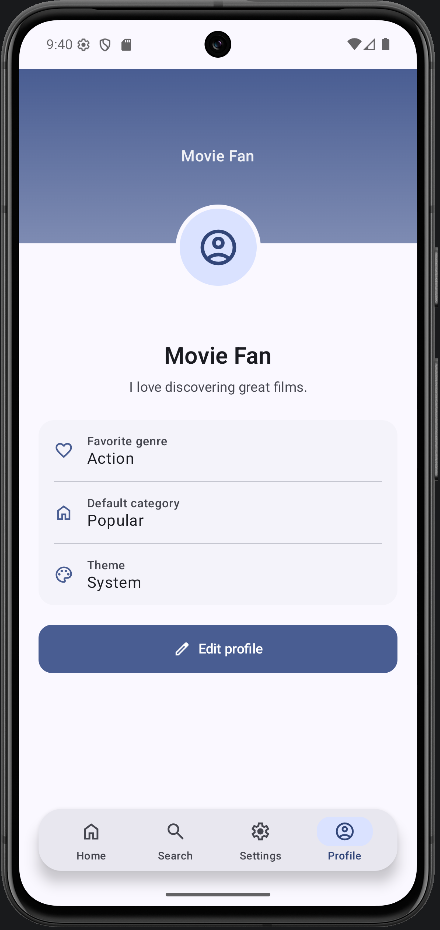
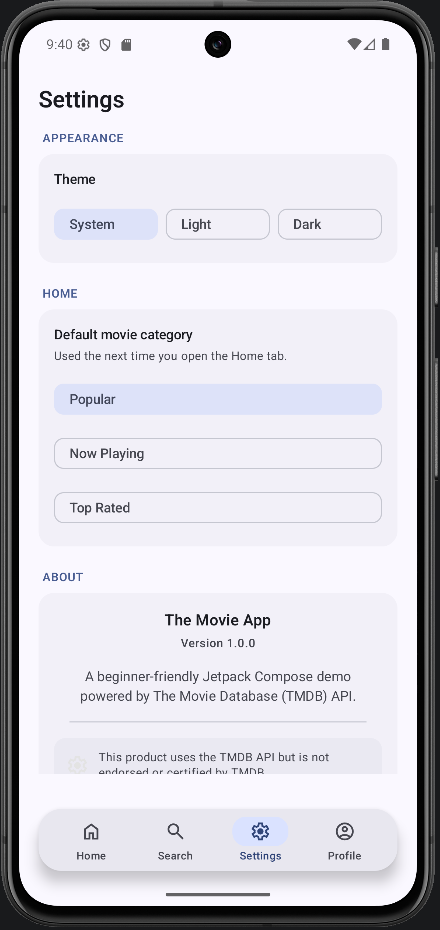

# 🎬 The Movie App


**The Movie App** is a modern Android movie discovery application built with **Kotlin and Jetpack Compose**.

Powered by the **TMDB API**, it lets users discover movies, search across the catalog, explore detailed information, save favorites, and receive personalized recommendations.

The app also explores real-world Android concerns such as **authentication, pagination, caching, offline support, persistent preferences, error handling, and unidirectional data flow**.

> **A movie discovery experience built to explore modern Android development beyond the basics.**

---

## 📱 Screenshots

<table>
<tr>
<td></td>
<td></td>
<td></td>
<td></td>
</tr>
</table>

<table>
<tr>
<td></td>
</tr>
</table>

---

## ✨ Features

### 🎬 Movie Discovery

* Browse **Popular**, **Now Playing**, and **Top Rated** movies
* Explore movies by category
* View detailed movie information including:

  * Posters and backdrops
  * Ratings
  * Runtime
  * Genres
  * Overview

### 🔎 Search & Pagination

* Debounced live movie search
* Infinite scrolling through search results
* Loading states and pagination indicators
* Retry support without losing already-loaded content

### ❤️ Favorites & Watchlist

* Save movies to a personal watchlist
* Persist favorites across app restarts
* Add/remove feedback through Material 3 snackbars

### 🧠 Personalized Recommendations

* Select a favorite genre
* Generate a **"Because you like..."** recommendation section
* Genre selection uses TMDB's official genre catalog

### 🔐 Authentication

Firebase Email/Password authentication with:

* Account creation
* Login
* Password reset
* Sign-out
* Persistent authentication state
* Profile name synchronization

### 👤 Profile & Settings

* Personalized display name
* Custom bio
* Favorite genre
* Theme preferences
* Default movie category
* Account information

### 📡 Offline & Network Resilience

The app is designed to remain useful when connectivity is unreliable:

* HTTP disk caching
* In-memory repository caching
* Stale-data fallback
* Cached movie details remain accessible offline
* Network-specific error handling
* Timeout and rate-limit handling
* Invalid API key detection

### 🎨 Material 3 UI

* Jetpack Compose UI
* Material 3 components
* Light, dark, and system themes
* Edge-to-edge layout
* Adaptive launcher icon
* Loading and error states
* High-quality image rendering with Coil

---

## 🛠️ Tech Stack

| Area                  | Technology                |
| --------------------- | ------------------------- |
| **Language**          | Kotlin 2.2.10             |
| **UI**                | Jetpack Compose           |
| **Design System**     | Material 3                |
| **Architecture**      | MVVM + Repository Pattern |
| **Navigation**        | Navigation Compose        |
| **Networking**        | Retrofit + OkHttp         |
| **Serialization**     | Kotlinx Serialization     |
| **Authentication**    | Firebase Authentication   |
| **Image Loading**     | Coil                      |
| **Local Persistence** | DataStore Preferences     |
| **State**             | ViewModel + StateFlow     |
| **Async**             | Kotlin Coroutines + Flow  |
| **Minimum SDK**       | Android 7.0 / API 24      |

### Core Android Technologies

`Kotlin` · `Jetpack Compose` · `Material 3` · `MVVM` · `Retrofit` · `OkHttp` · `Firebase` · `DataStore` · `ViewModel` · `StateFlow` · `Coroutines` · `Coil`

---

## 🏗️ Architecture

The Movie App follows **MVVM**, the **Repository Pattern**, and **unidirectional data flow**.

```text
┌─────────────────────────────────┐
│          Compose UI             │
│ Home · Search · Details · etc.  │
└───────────────┬─────────────────┘
                │ UI Events
                ▼
┌─────────────────────────────────┐
│           ViewModels            │
│        StateFlow · UI State     │
└───────────────┬─────────────────┘
                │
                ▼
┌─────────────────────────────────┐
│           Repositories          │
│ Movie · Auth · Preferences      │
│ Watchlist                       │
└───────┬──────────────┬──────────┘
        │              │
        ▼              ▼
┌──────────────┐  ┌───────────────┐
│ TMDB / API   │  │ Local Storage │
│ Retrofit     │  │ DataStore     │
│ OkHttp       │  │ Cache         │
└──────────────┘  └───────────────┘
        │
        ▼
┌──────────────────┐
│ Firebase Auth    │
└──────────────────┘
```

### Architecture Highlights

* **Single-Activity Architecture:** The application runs through a single `MainActivity`.
* **Compose Navigation:** Navigation Compose manages authentication, bottom-navigation destinations, movie details, and settings.
* **Repository Layer:** API, authentication, preferences, and watchlist operations are abstracted behind repositories.
* **Unidirectional Data Flow:** ViewModels expose `StateFlow` state while UI events flow back through ViewModel actions.
* **Manual Dependency Injection:** Application-level dependencies are provided through `MovieApplication` and ViewModel factories.
* **Caching:** Network responses are supported by HTTP disk caching and repository-level in-memory caching.

---

## 📂 Project Structure

```text
app/
├── data/
│   ├── auth/
│   │   ├── AuthRepository.kt
│   │   └── AuthState.kt
│   ├── MovieRepository.kt
│   ├── PreferencesRepository.kt
│   ├── WatchlistRepository.kt
│   ├── MovieErrors.kt
│   └── UserPreferences.kt
│
├── model/
│   └── Movie / MovieDetail / Genre models
│
├── network/
│   ├── Retrofit service
│   ├── OkHttp client
│   └── image configuration
│
├── ui/
│   ├── components/
│   ├── detail/
│   ├── home/
│   ├── profile/
│   ├── search/
│   ├── settings/
│   ├── watchlist/
│   ├── theme/
│   └── NavGraph.kt
│
├── MainActivity.kt
└── MovieApplication.kt
```

---

## 🚀 Getting Started

### Requirements

* **Android Studio** Ladybug or newer
* JDK compatible with the project's Android Gradle Plugin
* Android device or emulator running **Android 7.0 / API 24+**
* TMDB API key
* Firebase project with Email/Password authentication enabled

### 1. Clone the repository

```bash
git clone https://github.com/SamratVsn/TheMovieApp.git
cd TheMovieApp
```

### 2. Configure the TMDB API

Create `local.properties` from the provided template:

```bash
cp local.properties.example local.properties
```

Then add your API key:

```properties
TMDB_API_KEY=your_api_key_here
```

The real API key should **never be committed** to the repository.

For CI/headless builds, the project also supports:

```text
~/.gradle/gradle.properties
-PTMDB_API_KEY=...
TMDB_API_KEY environment variable
```

### 3. Configure Firebase

Create a Firebase project and enable **Email/Password Authentication**.

Download `google-services.json` for:

```text
com.example.themovieapp
```

and place it at:

```text
app/google-services.json
```

This file is git-ignored and should not be committed.

### 4. Build & Run

Open the project in Android Studio, allow Gradle to sync, and run the application on an emulator or physical device.

---

## 🔐 Security Notes

* `local.properties` is git-ignored and should contain your TMDB API key.
* `google-services.json` is also git-ignored.
* Firebase client configuration is not equivalent to a private secret, but appropriate package and SHA restrictions should still be configured.
* A truly private API key cannot be protected inside a distributed APK. For stronger protection, a backend proxy can be used.

---

## 📋 Requirements

| Requirement           | Version    |
| --------------------- | ---------- |
| Minimum SDK           | 24         |
| Target SDK            | 37         |
| Compile SDK           | 37         |
| Kotlin                | 2.2.10     |
| Android Gradle Plugin | 9.4.1      |
| Compose BOM           | 2026.02.01 |
| Material 3            | 1.4.0      |
| Navigation Compose    | 2.9.8      |

---

## 📦 Key Libraries

| Library                 | Purpose                               |
| ----------------------- | ------------------------------------- |
| Jetpack Compose         | Native Android UI                     |
| Material 3              | Design system                         |
| Navigation Compose      | Application navigation                |
| Retrofit                | TMDB API communication                |
| OkHttp                  | HTTP client, caching & timeouts       |
| Kotlinx Serialization   | JSON serialization                    |
| Firebase Authentication | User authentication                   |
| Coil                    | Poster and backdrop loading           |
| DataStore               | Local preferences & watchlist         |
| Coroutines & Flow       | Asynchronous and reactive programming |
| AndroidX Lifecycle      | ViewModel & lifecycle-aware state     |

---

## 🔮 Roadmap

* 🎞️ Trailer integration
* ☁️ Cloud-synchronized watchlists
* 🔑 Google Sign-In & email verification
* 📄 Paging 3 migration
* 🔔 Push notifications
* 🛡️ Release hardening with R8/minification
* 🧪 Expanded automated test coverage
* 🔐 Firebase App Check enforcement

---

## 👨‍💻 Author

**Samrat Parajuli**

Android Developer focused on **Kotlin, Jetpack Compose, and modern Android development**.

* GitHub: [@SamratVsn](https://github.com/SamratVsn)
* Portfolio: [samratparajuli0.com.np](https://www.samratparajuli0.com.np/)
* LinkedIn: [Samrat Parajuli](https://linkedin.com/in/samratvsn)

---

## 📄 License

This project is licensed under the **MIT License**. See [`LICENSE`](LICENSE) for details.

---

<div align="center">

**Built with Kotlin & Jetpack Compose 🎬**

</div>
